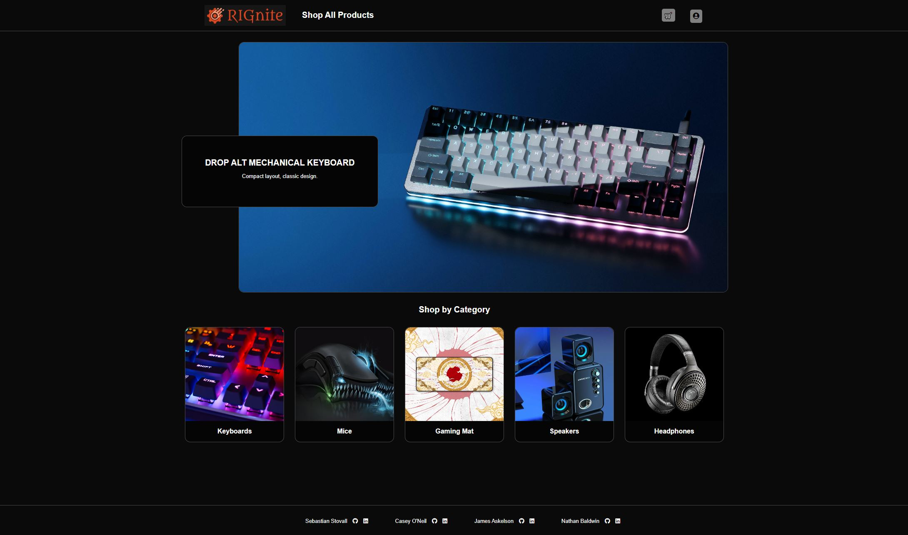
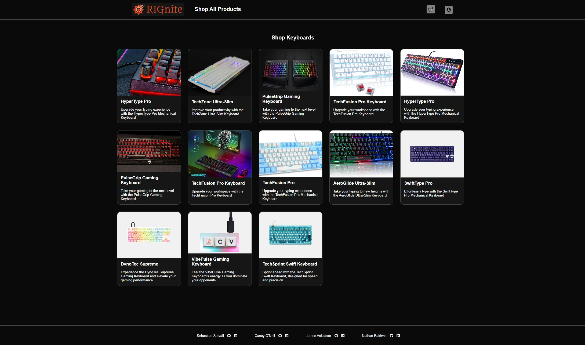

# Rignite

Rignite is an eCommerce site, based on the site Drop.com, that focuses on selling computer products and accessories. Rignite offers highly customized gear for the gaming enthusiast, including incredible key-caps like "The Eye of Sauron," and gaming mats like the "Ameratsu."

- Check out [Rignite](https://rignite.onrender.com/) here
- Connect With Us: [Sebastian Stovall](https://www.linkedin.com/in/sebastian-stovall-a17a8a211/), [Nathan Baldwin](https://www.linkedin.com/in/nathan-baldwin-48959714/), [Casey O'Neil](https://www.linkedin.com/in/casey-o-neil-993b7228a/), [James Askelson](https://www.linkedin.com/in/james-askelson-bb4b6928a/)

[MVP Feature List](https://github.com/nathanrobertbaldwin/rignite/wiki/Features-List) | [Database Schema](https://github.com/nathanrobertbaldwin/rignite/wiki/Database-and-Routes) | [Getting Started](https://github.com/nathanrobertbaldwin/rignite/wiki/Getting-Started)

## Technologies Used

### Backend

- Python
- Flask
- PostgresQL

### Frontend

- React
- Redux
- HTML
- CSS

## Home Page

## Product Page

## Features

### Table: Products
GET

    • Index of products is the entry point for the User story.
    • All visitors can get index of Products.
    • All products are shown on individual product cards on the Index page.
    • The product cards show basic information about the product.
    • Users can click product cards to get detailed product information, including specs.

POST

    • Logged in Admins can create new Products. Users are unable to use the create new product page.

PATCH

    • Logged in Admins can edit Products.

DELETE

    • Logged in Admins can delete Products.

### Table: Admins and Customers
Login

    • Modal from navigation. Available on all pages.
    • Separate field for validating Admins

POST

    • Modal from navigation. Available on all pages.
    • Separate field for validating Admins.

UPDATE

    • Logged in Users can manage their account on a separate my profile page.
    • User can edit their information.
    • Form auto-populates with existing User data pulled from server.

DELETE

    • From separate my profile page for User account management.
    • Button opens a modal for confirmation of delete of User account.

### Table: Orders

GET

    • Users can review their past orders.
    • Users can see order status, including in-transit, delivered, canceled.
    • Order status will include a deliver-by date.

POST

    • Users can create new orders through a shopping cart.

REACT

    • Logged in Users can add products to their shopping cart.
    • The shopping cart will persist between sessions for logged in Users. (?)
    • Within the shopping cart, Users can remove items or increase quantity of items purchased.
    • Users can submit a shopping cart to create an order.

PATCH

    • Users can edit their orders before shipment.

DELETE

    • Users can cancel their orders before shipment.

### Table: Reviews

GET

    • Users can see their past reviews on their my profile page.

POST

    • User can create a new review on a product if they haven’t reviewed.

PATCH

    • If a User owns review, they can edit their review.

DELETE

    • If a User owns review, they can delete their review.

## Endpoints

### Users
|  Request                                      | Purpose                                                                                                                     | Response
|  --------                                     | --------                                                                                                                    | --------
|  GET /api/users                               | Query for all users and returns them in a list of user dictionaries.                                                        | {   "users": [   { "address": "123 Main St",   "city": "Anytown",   "email": "admin@rignite.com",   "first_name": "Adam",   "id": 1,   "is_admin": true,   "last_name": "Minin",   "state": "CA",   "username": "admin",   "zip_code": 12345 }, ... ]   }
| PUT /api/users/manage                         | Logged in Users can manage their account on a separate my profile page. User can edit their information.                    | {   "address": "123 Main St",   "city": "Anytown",   "email": "Demo-lition@example.com",   "first_name": "Demo",   "id": 2,   "is_admin": false,   "last_name": "Lition",   "state": "CA",   "username": "Demo-lition",   "zip_code": 12345   }
| DELETE /api/users/delete                      | From separate my profile page for User account management. Button opens a modal for confirmation of delete of User account. | {"message": "User successfully deleted"}
| GET /api/users/<int:id>                       | Query for a user by id and returns that user in a dictionary.                                                               | {   "address": "123 Main St",   "city": "Anytown",   "email": "Demo-lition@example.com",   "first_name": "Demo",   "id": 2,   "is_admin": false,   "last_name": "Lition",   "state": "CA",   "username": "Demo-lition",   "zip_code": 12345   }

### Session
|  Request                                      | Purpose                                           | Response
|  -------------------------------------------  |  ------------------------------------------------ | ------------------------------------------------
|  GET /api/auth                                |  Returns the information for the logged in user   | {   "address": "123 Main St",   "city": "Anytown",   "email": "Demo-lition@example.com",   "first_name": "Demo",   "id": 2,   "is_admin": false,   "last_name": "Lition",   "state": "CA",   "username": "Demo-lition",   "zip_code": 12345   }
|  POST /api/auth/login                         |  Logs a user in.                                  | {   "address": "123 Main St",   "city": "Anytown",   "email": "Demo-lition@example.com",   "first_name": "Demo",   "id": 2,   "is_admin": false,   "last_name": "Lition",   "state": "CA",   "username": "Demo-lition",   "zip_code": 12345   }
|  GET /api/auth/logout                         |  Logs a user out                                  | {"message": "User logged out"}
|  POST /api/auth/signup                        |  Creates a new user and logs them in              | {   "address": "123 Main St",   "city": "Anytown",   "email": "Demo-lition@example.com",   "first_name": "Demo",   "id": 2,   "is_admin": false,   "last_name": "Lition",   "state": "CA",   "username": "Demo-lition",   "zip_code": 12345   }

### Categories
|  Request                                      | Purpose                                                                       | Response
|  -------------------------------------------  |  --------------------------------------------------------------------------   | ------------------------------------------------
|  GET /api/categories/all                      | Gets all product categories and returns them in a list of user dictionaries.  | [   { "id": 1,   "name": "Keyboards",   "photo_url": "https://prosettings.net/cdn-cgi/image/dpr=1%2Cf=auto%2Cfit=cover%2Cheight=500%2Cq=85%2Cwidth=1000/wp-content/uploads/keyboard-size-differences-explained-1.png" },   { "id": 2,   "name": "Mice",   "photo_url": "https://c4.wallpaperflare.com/wallpaper/28/400/999/razer-computer-mice-wallpaper-preview.jpg" },   { "id": 3,   "name": "Gaming Mat",   "photo_url": "https://stackskb.com/wp-content/uploads/2021/08/koshitsu.jpg" },   { "id": 4,   "name": "Speakers",   "photo_url": "https://i.ebayimg.com/images/g/8LYAAOSwZOZhf4~z/s-l500.jpg" },   { "id": 5,   "name": "Headphones",   "photo_url": "https://media.wired.com/photos/63e69de969cf98bf35404277/1:1/w_1278,h_1278,c_limit/Best-Wireless-Headphones-Featured-Focal-Bathys-Gear.jpg" }   ]

### Products
|  Request                                      | Purpose                                                                                                       | Response
|  -------------------------------------------  |  ------------------------------------------------                                                             | -------------------------
|  GET /api/products/all                        |  Get all products, associated reviews, and associated photos and returns them in a list of user dictionaries. | [   { "admin_id": 1,   "brand": "HyperType",   "category_id": 1,   "color": "Black",   "description": "Upgrade your typing experience with the HyperType Pro Mechanical Keyboard. This premium keyboard features Cherry MX Red switches, providing a smooth and quiet typing experience. The aluminum top plate adds durability and a sleek look to your setup. Customize the per-key RGB lighting to match your style, and enjoy the convenience of programmable macros for faster execution. The detachable wrist rest ensures comfort during extended typing sessions.",   "id": 1,   "price": "129.99",   "product_name": "HyperType Pro",   "product_photos": [   { "id": 1,   "product_id": 1,   "url": "https://assets2.razerzone.com/images/pnx.assets/8fb5475d12dfba14ee9391ae8fc0e458/razer-blackwidow-v4-pro-refined-control-1920x700.jpg" } ],   "product_reviews": [ { "id": 1,   "photo_url": null,   "product_id": 1,   "rating": 5,   "review": "I purchased this with the intent of using the board for a bulbasaur keyboard build. The switches are clacky and I hate it. I prefer thocky sounds, and I could get over the sound if it was good to type on - but I find it to be lackluster.",   "user": { "address": "123 Main St",   "city": "Anytown",   "email": "Demo-lition@example.com",   "first_name": "Demo",   "id": 2,   "is_admin": false,   "last_name": "Lition",   "state": "CA",   "username": "Demo-lition",   "zip_code": 12345 } } ],   "specs": "Product Specifications, Keyboard Type: Mechanical Keyboard, Switch Type: Cherry MX Red, Key Lifespan: 50 million keystrokes, Key Rollover: Full N-Key Rollover (NKRO) with Anti-Ghosting, Backlighting: Per-key RGB Backlighting, Layout: Full-sized 104-key layout with numeric keypad and multimedia keys, Connectivity: Wired USB 3.0, Gold-plated corrosion-resistant connector, Cable: Braided, Detachable USB cable, Construction: Aluminum top plate, Color: Black, Dimensions: 17.1 x 5.2 x 1.4 inches (L x W x H), Weight: Approx. 2.6 lbs (1.18 kg)",   "status": "active" }, ...    ]
|  POST /api/products/new                       |  A user with admin privileges can create a new product. Adds up to four images for a product.                 | [   { "admin_id": 1,   "brand": "HyperType",   "category_id": 1,   "color": "Black",   "description": "Upgrade your typing experience with the HyperType Pro Mechanical Keyboard. This premium keyboard features Cherry MX Red switches, providing a smooth and quiet typing experience. The aluminum top plate adds durability and a sleek look to your setup. Customize the per-key RGB lighting to match your style, and enjoy the convenience of programmable macros for faster execution. The detachable wrist rest ensures comfort during extended typing sessions.",   "id": 1,   "price": "129.99",   "product_name": "HyperType Pro",   "product_photos": [ ],   "product_reviews": [ ],   "specs": "Product Specifications, Keyboard Type: Mechanical Keyboard, Switch Type: Cherry MX Red, Key Lifespan: 50 million keystrokes, Key Rollover: Full N-Key Rollover (NKRO) with Anti-Ghosting, Backlighting: Per-key RGB Backlighting, Layout: Full-sized 104-key layout with numeric keypad and multimedia keys, Connectivity: Wired USB 3.0, Gold-plated corrosion-resistant connector, Cable: Braided, Detachable USB cable, Construction: Aluminum top plate, Color: Black, Dimensions: 17.1 x 5.2 x 1.4 inches (L x W x H), Weight: Approx. 2.6 lbs (1.18 kg)",   "status": "active" }, ...    ]
|  POST /api/products/edit/<int:productId>      |  A user with admin privileges can edit a product, including the addition of extra images.                     | [   { "admin_id": 1,   "brand": "HyperType",   "category_id": 1,   "color": "Black",   "description": "Upgrade your typing experience with the HyperType Pro Mechanical Keyboard. This premium keyboard features Cherry MX Red switches, providing a smooth and quiet typing experience. The aluminum top plate adds durability and a sleek look to your setup. Customize the per-key RGB lighting to match your style, and enjoy the convenience of programmable macros for faster execution. The detachable wrist rest ensures comfort during extended typing sessions.",   "id": 1,   "price": "129.99",   "product_name": "HyperType Pro",   "product_photos": [ ],   "product_reviews": [ ],   "specs": "Product Specifications, Keyboard Type: Mechanical Keyboard, Switch Type: Cherry MX Red, Key Lifespan: 50 million keystrokes, Key Rollover: Full N-Key Rollover (NKRO) with Anti-Ghosting, Backlighting: Per-key RGB Backlighting, Layout: Full-sized 104-key layout with numeric keypad and multimedia keys, Connectivity: Wired USB 3.0, Gold-plated corrosion-resistant connector, Cable: Braided, Detachable USB cable, Construction: Aluminum top plate, Color: Black, Dimensions: 17.1 x 5.2 x 1.4 inches (L x W x H), Weight: Approx. 2.6 lbs (1.18 kg)",   "status": "active" }, ...    ]

### Orders
|  Request                                      | Purpose                                                                         | Response
|  -------------------------------------------  |  ------------------------------------------------                               | ------------------------------------------------
|  GET /api/orders/                             |  Gets all user order details and returns them in a list of user dictionaries.   | [   { "batch_id": "0aj9fa09jdfa0f9dj",   "order_date": "2023-07-20",   "order_product": {   "admin_id": 1,   "brand": "HyperType",   "category_id": 1,   "color": "Black",   "description": "Upgrade your typing experience with the HyperType Pro Mechanical Keyboard. This premium keyboard features Cherry MX Red switches, providing a smooth and quiet typing experience. The aluminum top plate adds durability and a sleek look to your setup. Customize the per-key RGB lighting to match your style, and enjoy the convenience of programmable macros for faster execution. The detachable wrist rest ensures comfort during extended typing sessions.",   "id": 1,   "price": "129.99",   "product_name": "HyperType Pro",   "product_photos": [   { "id": 1,   "product_id": 1,   "url": "https://assets2.razerzone.com/images/pnx.assets/8fb5475d12dfba14ee9391ae8fc0e458/razer-blackwidow-v4-pro-refined-control-1920x700.jpg" } ],   "product_reviews": [   { "id": 1,   "photo_url": null,   "product_id": 1,   "rating": 5,   "review": "I purchased this with the intent of using the board for a bulbasaur keyboard build. The switches are clacky and I hate it. I prefer thocky sounds, and I could get over the sound if it was good to type on - but I find it to be lackluster.",   "user": {   "address": "123 Main St",   "city": "Anytown",   "email": "Demo-lition@example.com",   "first_name": "Demo",   "id": 2,   "is_admin": false,   "last_name": "Lition",   "state": "CA",   "username": "Demo-lition",   "zip_code": 12345 },   "user_id": 2 } ],   "specs": "Product Specifications, Keyboard Type: Mechanical Keyboard, Switch Type: Cherry MX Red, Key Lifespan: 50 million keystrokes, Key Rollover: Full N-Key Rollover (NKRO) with Anti-Ghosting, Backlighting: Per-key RGB Backlighting, Layout: Full-sized 104-key layout with numeric keypad and multimedia keys, Connectivity: Wired USB 3.0, Gold-plated corrosion-resistant connector, Cable: Braided, Detachable USB cable, Construction: Aluminum top plate, Color: Black, Dimensions: 17.1 x 5.2 x 1.4 inches (L x W x H), Weight: Approx. 2.6 lbs (1.18 kg)", "status": "active" },   "product_id": 1,   "quantity": 1,   "status": "pending",   "total": "100.00",   "user_id": 2 }, ...   ]
|  POST /api/orders/                            |  Adds a new product order for a user.                                           | {   "id": 4,   "user_id": 1,   "product_id": 7,   "batch_id": 0aj9fa09jdfa0f9dj,   "quantity": 1,   "order_date": "2023-07-20",   "total": 123.43,   "status": "pending"   }
|  PUT /api/orders/<string:batchId>             |  Edits an order for a user.                                                     | {   "id": 4,   "user_id": 1,   "product_id": 7,   "batch_id": 0aj9fa09jdfa0f9dj,   "quantity": 1,   "order_date": "2023-07-20",   "total": 123.43,   "status": "pending"   }
|  DELETE /api/orders/<string:batchId>          |  Deletes an order for a user.                                                   | {"message": "successfully deleted order"}

### Reviews
|  Request                                      | Purpose                                                                        | Response
|  -------------------------------------------  |  ------------------------------------------------                              | ------------------------------------------------
|  GET /api/reviews                             |  Gets all reviews for a user and returns them in a list of user dictionaries.  | [   { "id": 1,   "photo_url": null,   "product_id": 1,   "rating": 5,   "review": "I purchased this with the intent of using the board for a bulbasaur keyboard build. The switches are clacky and I hate it. I prefer thocky sounds, and I could get over the sound if it was good to type on - but I find it to be lackluster.",   "user": { "address": "123 Main St",   "city": "Anytown",   "email": "Demo-lition@example.com",   "first_name": "Demo",   "id": 2,   "is_admin": false,   "last_name": "Lition",   "state": "CA",   "username": "Demo-lition",   "zip_code": 12345 },   "user_id": 2 }, ...   ]
|  POST /api/reviews/new                        |  Creates a new review from a user on a specific product.                       | {   "user_id": 2,   "product_id": 1,   "review": "I purchased this with the intent of using the board for a bulbasaur keyboard build. The switches are clacky and I hate it. I prefer thocky sounds, and I could get over the sound if it was good to type on - but I find it to be lackluster.",   "rating": 5,   "photo_url": None   }
|  PUT /api/reviews/<int:reviewId>              |  user can edit a review they created.                                          | {   "user_id": 2,   "product_id": 1,   "review": "I purchased this with the intent of using the board for a bulbasaur keyboard build. The switches are clacky and I hate it. I prefer thocky sounds, and I could get over the sound if it was good to type on - but I find it to be lackluster.",   "rating": 5,   "photo_url": None  }
|  DELETE /api/reviews/<int:reviewId>           |  A user can delete a review they posted.                                       | {"message": "successfully deleted review"}
=======
# Links

Live Link: https://rignite.onrender.com

Getting Started: https://github.com/nathanrobertbaldwin/rignite/wiki/Getting-Started

Database and Routes: https://github.com/nathanrobertbaldwin/rignite/wiki/Database-and-Routes

Tech Stack: https://github.com/nathanrobertbaldwin/rignite/wiki/Tech-Stack

Features List: https://github.com/nathanrobertbaldwin/rignite/wiki/Features-List

